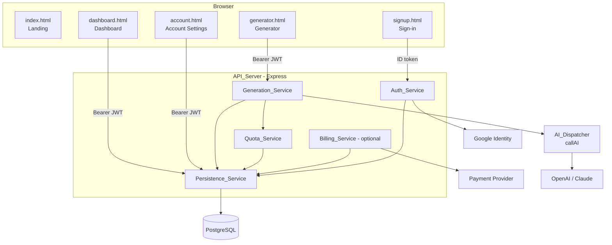
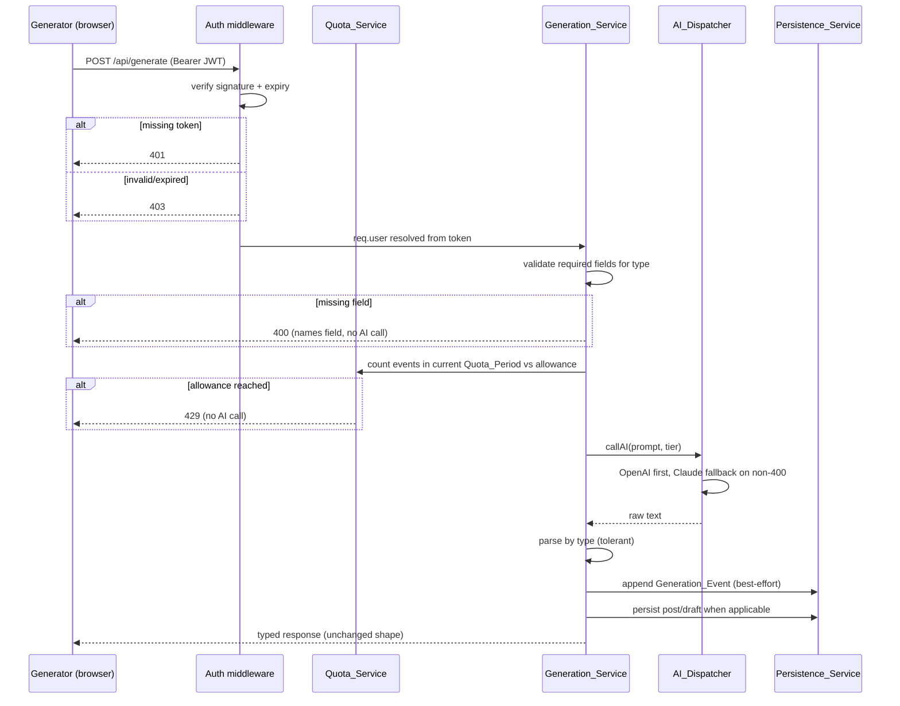
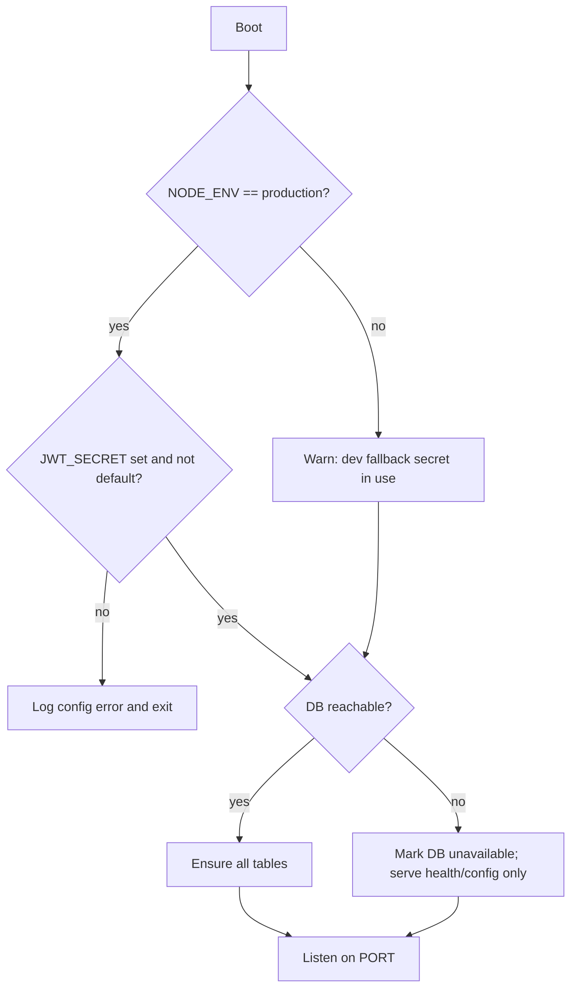

# Design Document

## Overview

This design evolves RoftX from a thin single-table app into a multi-user SaaS platform while preserving the existing AI generation workflow byte-for-byte. The work is organized into three concerns layered on top of today's `roftx_backend/server.js`:

1. **Persistence foundation** — a relational schema (`users`, `voice_profiles`, `posts`, `generations`, `usage_quotas`) plus a `Persistence_Service` that owns all reads/writes, scoped strictly to the authenticated user.
2. **Platform services** — `Quota_Service` (server-enforced per-plan limits), generation event logging, optional `Billing_Service`, and account management.
3. **Hardening** — strong JWT secret enforcement in production, reconciled CORS allow-list sourced from config, mandatory authentication on every generation path (including legacy `/api/gemini`), and tolerant AI response parsing.

The generation steps (`topics`, `voice`, `hooks`, `post`, `refine`, `regenerate`), the `callAI` dispatcher (OpenAI primary → Claude fallback), the six prompt builders in `prompts.js`, and the tier mapping are treated as a **fixed capability**. This design wraps them with authentication, persistence, logging, and quota checks; it does not redesign their internals or response shapes.

### Design Principles

- **Preserve the workflow.** The `/api/generate` request/response contract and the parsers stay behaviorally identical; we only add cross-cutting concerns around them.
- **Server is the source of truth for identity and limits.** Ownership is always derived from the verified `Session_Token`, never from client-supplied IDs. Quotas are enforced server-side before any AI call.
- **Graceful degradation.** If the database is unreachable, health/config endpoints still serve and DB status is reported as unavailable, matching the current no-DB tolerance.
- **Fail safe on security config.** A production boot with a missing or default `JWT_SECRET` halts startup rather than silently running insecurely.

### Research Notes

- **Existing auth flow** (`signup.html` → `POST /api/auth/google` → JWT in `localStorage` under `roftx_token` → `Authorization: Bearer` on `/api/generate`) is the model all new authenticated endpoints follow. The JWT payload already carries `{ userId, googleId, email }`, so `userId` is available for ownership scoping without extra lookups when present.
- **Frontend API base selection** is duplicated in `signup.html` and `generator.html` (`localhost` → `http://localhost:3000`, else `https://roftx-1.onrender.com`). New pages (`dashboard.html`, account settings) reuse the same convention.
- **CORS today** is a hardcoded `ALLOWED_ORIGINS` array in `server.js`. The deployed frontend origin in code (`roftx-front02.onrender.com`) and the API base used by the frontend (`roftx-1.onrender.com`) must be reconciled via configuration (Requirement 3.3) so deploys don't require code edits.
- **`pg` (node-postgres)** is already a dependency; parameterized queries (`$1, $2, …`) are the established pattern in `ensureUsersTable`/auth and are used throughout for injection safety.
- **AI parsing** currently splits on `CONVERSATION [N]`, `HOOK [N] —`, and uses `lastIndexOf` for `CHANGE MADE:` / `NEW ANGLE USED:` markers. Tolerance work generalizes the delimiters (whitespace, optional numbering/brackets, hook delimiter variants) without changing the returned shapes.

## Architecture

### System Context



### Request Lifecycle for a Generation Call



### Startup Sequence



### Module Layout

The backend remains a small set of modules under `roftx_backend/`. `server.js` stays the composition root; new responsibilities are factored into focused modules so they are unit-testable in isolation:

| Module | Responsibility |
|--------|----------------|
| `server.js` | App composition, middleware wiring, startup validation, route registration |
| `config.js` | Reads env, exposes `JWT_SECRET`, `ALLOWED_ORIGINS`, plan definitions, billing-enabled flag; performs production secret validation |
| `db/schema.js` | `ensureSchema()` creating all five tables idempotently |
| `db/persistence.js` | `Persistence_Service`: ownership-scoped CRUD for voice profiles, posts, generation events; account export/delete |
| `services/quota.js` | `Quota_Service`: period resolution, usage count, allowance lookup, enforcement |
| `services/generation.js` | Prompt building, parsing (tolerant), typed `/api/generate` orchestration |
| `services/billing.js` | Optional `Billing_Service`: checkout, webhook verification, plan transitions |
| `middleware/auth.js` | `authenticateToken`, ownership helpers |
| `prompts.js` | Unchanged prompt builders |

This is a refactor of organization, not behavior — `/api/generate` and the parsers move into `services/generation.js` with identical logic plus the tolerance and quota/logging hooks.

## Components and Interfaces

### Auth_Service

- `POST /api/auth/google` — unchanged verification of Google ID token; on success upserts the user and issues a 7-day JWT signed with the configured `JWT_SECRET`. New users get `plan = 'free'` and `credits_remaining = FREE_ALLOWANCE`.
- `authenticateToken(req,res,next)` middleware:
  - No token → `401`.
  - Invalid/expired token → `403`.
  - Valid → attaches `req.user = { userId, googleId, email }`.
- Ownership resolution: when `req.user.userId` is null (DB was unavailable at sign-in), the service resolves the user row by `googleId` before any owned operation; this keeps identity derived from the token, never from request body.

### Generation_Service

- `POST /api/generate` (auth required) — same six types, same validation, same response shapes (`topics`, `voiceProfile`, `hooks`, `post`, `refine` with `changeMade`, `regenerate` with `newAngle`). Adds: quota pre-check (429), best-effort event logging, and optional post persistence for `post` results when the client requests it.
- `POST /api/gemini` (legacy) — now requires a valid `Session_Token` before any AI call (Requirement 3.4/3.5). Otherwise behavior unchanged.
- Tolerant parsers: `parseTopics`, `parseHooks`, `splitMeta` (details under Data Models / Correctness Properties).

### Persistence_Service

All methods take the authenticated `userId` as the ownership key and return only that user's data. Cross-owner access yields `404`.

| Operation | Endpoint | Notes |
|-----------|----------|-------|
| Save voice profile | `POST /api/voice-profiles` | body `{ label, content }` → returns `{ id }` |
| List voice profiles | `GET /api/voice-profiles` | owner-scoped |
| Delete voice profile | `DELETE /api/voice-profiles/:id` | 404 if not owned |
| Create/update post | `POST /api/posts` | upsert owned `Post_Record`; preserves content exactly |
| Finalize post | `POST /api/posts/:id/finalize` | sets status `final`, bumps `updated_at` |
| List posts | `GET /api/posts?q=&status=` | owner-scoped, ordered by `updated_at` desc; search/filter |
| Delete post | `DELETE /api/posts/:id` | 404 if not owned |
| Current usage | `GET /api/usage` | `{ used, allowance, period }` |
| Export data | `GET /api/account/export` | profile + voice profiles + posts |
| Delete account | `DELETE /api/account` | cascades user + owned rows |
| Update account field | `PATCH /api/account` | persists editable fields, bumps `updated_at` |

### Quota_Service

- `getPeriod(date) → 'YYYY-MM'` — calendar month key.
- `getAllowance(plan) → number` — from plan definitions (`free`, `paid`).
- `getUsage(userId, period) → count` — count of `generations` in the period.
- `enforce(userId, plan) → ok | { exceeded: true }` — called before AI; on exceeded the route returns `429` and performs no AI call.

### Billing_Service (optional, gated by `BILLING_ENABLED`)

- `POST /api/billing/checkout` — creates a provider checkout session, returns redirect target.
- `POST /api/billing/webhook` — verifies provider signature; on verified success sets plan to paid and updates allowance; on cancel/expire downgrades to free at period end; unverifiable signature → `400`, no plan change.
- When disabled, every user is treated as Free and billing endpoints are not registered.

### Frontend Pages

- `dashboard.html` (new) — lists posts with status/niche/topic, copy/delete actions, draft resume into `generator.html`, voice profile list, usage vs allowance, New Post action, search + status filter. Redirects unauthenticated visitors to `signup.html`; if redirect cannot occur, renders a sign-in prompt instead of user data.
- `account.html` (new) — shows name/email/plan/usage, editable fields, export, delete account; same auth redirect rule.
- `generator.html` (extended) — offers saved voice profiles for selection; a selected profile is supplied to hook/post/refine/regenerate; with none selected the existing writing-sample step is unchanged; if a selected profile cannot be supplied it falls back to the writing-sample step automatically.

## Data Models

### Database Schema

```sql
-- users (extended from today's table)
CREATE TABLE IF NOT EXISTS users (
  id                SERIAL PRIMARY KEY,
  google_id         VARCHAR(255) UNIQUE NOT NULL,
  email             VARCHAR(255) UNIQUE NOT NULL,
  full_name         VARCHAR(255),
  given_name        VARCHAR(255),
  family_name       VARCHAR(255),
  picture_url       TEXT,
  locale            VARCHAR(10),
  plan              VARCHAR(32)  NOT NULL DEFAULT 'free',
  credits_remaining INTEGER      NOT NULL DEFAULT 25,
  last_login        TIMESTAMP DEFAULT NOW(),
  created_at        TIMESTAMP DEFAULT NOW(),
  updated_at        TIMESTAMP DEFAULT NOW()
);

CREATE TABLE IF NOT EXISTS voice_profiles (
  id         SERIAL PRIMARY KEY,
  user_id    INTEGER NOT NULL REFERENCES users(id) ON DELETE CASCADE,
  label      VARCHAR(255) NOT NULL,
  content    TEXT NOT NULL,
  created_at TIMESTAMP DEFAULT NOW()
);

CREATE TABLE IF NOT EXISTS posts (
  id          SERIAL PRIMARY KEY,
  user_id     INTEGER NOT NULL REFERENCES users(id) ON DELETE CASCADE,
  niche       VARCHAR(200),
  topic       VARCHAR(500),
  chosen_hook TEXT,
  content     TEXT NOT NULL,
  status      VARCHAR(16) NOT NULL DEFAULT 'draft',  -- 'draft' | 'final'
  created_at  TIMESTAMP DEFAULT NOW(),
  updated_at  TIMESTAMP DEFAULT NOW()
);

CREATE TABLE IF NOT EXISTS generations (
  id         SERIAL PRIMARY KEY,
  user_id    INTEGER NOT NULL REFERENCES users(id) ON DELETE CASCADE,
  gen_type   VARCHAR(32) NOT NULL,  -- topics|voice|hooks|post|refine|regenerate
  period     VARCHAR(7)  NOT NULL,  -- 'YYYY-MM'
  created_at TIMESTAMP DEFAULT NOW()
);

CREATE TABLE IF NOT EXISTS usage_quotas (
  id         SERIAL PRIMARY KEY,
  user_id    INTEGER NOT NULL REFERENCES users(id) ON DELETE CASCADE,
  period     VARCHAR(7) NOT NULL,
  used       INTEGER NOT NULL DEFAULT 0,
  UNIQUE (user_id, period)
);
```

`usage_quotas` is an optional denormalized accelerator; the authoritative usage count is always derivable from `generations`. `generations.period` is stamped at insert from the event timestamp so period boundaries are stable regardless of read time.

### Plan Definitions (config)

```js
const PLANS = {
  free: { id: 'free', allowance: 25 },
  paid: { id: 'paid', allowance: 500 },
};
```

### API Response Shapes (preserved)

| Type | Response |
|------|----------|
| `topics` | `{ topics: [{ triggerType, premise, whyItWorks }] }` |
| `voice` | `{ voiceProfile: string }` |
| `hooks` | `{ hooks: [{ type, text, whyItWorks }] }` |
| `post` | `{ post: string }` |
| `refine` | `{ post: string, changeMade: string }` |
| `regenerate` | `{ post: string, newAngle: string }` |

### Domain Types

```ts
type Plan = 'free' | 'paid';

interface User {
  id: number; googleId: string; email: string;
  fullName?: string; plan: Plan; creditsRemaining: number;
  createdAt: string; updatedAt: string;
}

interface VoiceProfile {
  id: number; userId: number; label: string; content: string; createdAt: string;
}

interface PostRecord {
  id: number; userId: number;
  niche?: string; topic?: string; chosenHook?: string;
  content: string; status: 'draft' | 'final';
  createdAt: string; updatedAt: string;
}

interface GenerationEvent {
  id: number; userId: number; genType: string; period: string; createdAt: string;
}
```

## Correctness Properties

*A property is a characteristic or behavior that should hold true across all valid executions of a system — essentially, a formal statement about what the system should do. Properties serve as the bridge between human-readable specifications and machine-verifiable correctness guarantees.*

The platform layer is rich in pure, input-varying logic — ownership scoping, quota arithmetic, tolerant parsers, and content round-trips — which makes property-based testing a strong fit for the core. UI rendering (dashboard/account/generator pages), CORS wiring, external provider integration (billing checkout), and one-time schema/setup checks are **not** expressed as properties; they are covered by example, integration, and smoke tests in the Testing Strategy.

The properties below are the consolidated set produced after the prework reflection (redundant ownership, isolation, filter, and quota criteria were merged into single comprehensive properties).

### Property 1: Production secret fail-safe

*For any* combination of `NODE_ENV` and `JWT_SECRET` values, the startup configuration validator halts the boot if and only if `NODE_ENV` equals `production` AND `JWT_SECRET` is unset or equal to the built-in default; in every other case it permits startup (using the dev fallback only outside production).

**Validates: Requirements 2.1, 2.2**

### Property 2: Session token sign/verify round-trip and tamper rejection

*For any* token payload, a Session_Token signed with the configured `JWT_SECRET` verifies successfully with an expiry of 7 days, and *for any* token signed with a different secret or carrying a past expiry, verification is rejected.

**Validates: Requirements 2.3, 2.4**

### Property 3: Generation dispatch maps type to builder and tier

*For any* valid generation type in `{topics, voice, hooks, post, refine, regenerate}` with its required fields supplied, the Generation_Service invokes exactly the corresponding prompt builder and selects the tier mapped to that type (`fast` or `quality`), and no other builder is invoked.

**Validates: Requirements 4.1, 4.3**

### Property 4: Provider fallback condition

*For any* error status raised by the OpenAI provider, the AI_Dispatcher falls back to Claude if and only if the status is not 400 and Claude is configured; on a 400 error, or when Claude is not configured, it propagates the original error without falling back.

**Validates: Requirements 4.2**

### Property 5: Missing required field is rejected before any AI call

*For any* generation type and *any* single required field omitted from the request, the Generation_Service responds with HTTP 400 naming the missing field, performs no AI call, and returns no partial generation result.

**Validates: Requirements 4.4**

### Property 6: Preserved response shapes

*For any* generation type processed successfully, the response object contains exactly the preserved keys defined for that type (`topics`, `voiceProfile`, `hooks`, `post`, `post`+`changeMade`, `post`+`newAngle`).

**Validates: Requirements 4.5**

### Property 7: Topics parsing tolerance

*For any* list of topic blocks (each with a non-empty premise) rendered with arbitrary surrounding whitespace and optional numbering/bracket variations, `parseTopics` recovers every block's premise (and trigger/why-it-works fields when present).

**Validates: Requirements 5.1**

### Property 8: Hooks parsing tolerance

*For any* list of hook blocks rendered with any of the supported hook delimiter variations, `parseHooks` recovers each hook's text and its rationale.

**Validates: Requirements 5.2**

### Property 9: Structured parse failure signals an error

*For any* AI response from which no structured item can be extracted for a structured type (`topics`, `hooks`), the Generation_Service responds with HTTP 500 indicating a parsing failure.

**Validates: Requirements 5.3**

### Property 10: Metadata marker split round-trip

*For any* post body and *any* trailing metadata, `splitMeta(body + marker + meta)` returns the body as the post and the meta as the metadata; when the marker is absent, it returns the full text as the post body and empty metadata.

**Validates: Requirements 5.4**

### Property 11: Ownership-scoped reads

*For any* multi-user data set and *any* owned entity type (Voice_Profiles, Post_Records, Generation_Events), a read performed for a given User returns only records owned by that User and never a record owned by another User. Post_Record listings are additionally ordered from most recently updated to least recently updated.

**Validates: Requirements 6.2, 7.3, 13.3, 15.1**

### Property 12: Cross-owner access isolation

*For any* record owned by User A, *any* read, modify, or delete operation attempted by a different User B responds with HTTP 404 and discloses no record data. After a successful owner deletion, the record no longer appears in that owner's listings.

**Validates: Requirements 6.3, 6.4, 7.4, 7.5, 15.2**

### Property 13: Persisted content round-trip and field preservation

*For any* Post_Record content string (including arbitrary unicode and markdown) and *any* Voice_Profile label/content, writing the record and then reading it back returns byte-identical content along with the supplied metadata (niche, topic, chosen hook, label) and a recorded creation timestamp.

**Validates: Requirements 6.5, 7.1, 7.6, 13.2**

### Property 14: Finalize transition

*For any* owned Draft, finalizing it sets its status to `final` and yields an `updated_at` that is not earlier than its previous `updated_at`.

**Validates: Requirements 7.2**

### Property 15: Generation event counting and period stamping

*For any* timestamp, the Quota_Period stamped on a Generation_Event equals the calendar-month key (`YYYY-MM`) of that timestamp; and *for any* sequence of completed generations, the aggregate usage for a User in a period equals the number of that User's events whose stamped period matches.

**Validates: Requirements 8.1, 8.2, 8.3, 9.3**

### Property 16: Quota enforcement before AI call

*For any* User Plan and *any* current-period usage count, a new generation request is blocked with HTTP 429 and performs no AI call if and only if the usage count has reached the Plan's Generation_Allowance; otherwise the request proceeds to the AI call.

**Validates: Requirements 9.1, 9.2**

### Property 17: Allowance lookup and usage reporting

*For any* Plan identifier, `getAllowance` returns the allowance configured for that Plan (Free plan returns the Free allowance); and a usage query for any User returns the current-period event count together with that allowance.

**Validates: Requirements 9.4, 9.5, 14.5**

### Property 18: Combined search and status filter

*For any* set of a User's Post_Records, *any* search term, and *any* status filter, the result is exactly the set of that User's Post_Records whose niche, topic, or content contains the term AND whose status matches the filter; when no record satisfies the conditions the result is the empty list.

**Validates: Requirements 12.1, 12.2, 12.3, 12.4**

### Property 19: Account deletion cascade completeness

*For any* User's data set, deleting the account leaves zero rows owned by that User across `users`, `voice_profiles`, `posts`, and `generations`.

**Validates: Requirements 13.4**

### Property 20: Webhook signature fail-safe

*For any* billing webhook payload presented with an invalid or unverifiable signature, the Billing_Service responds with HTTP 400 and makes no change to any User's Plan.

**Validates: Requirements 14.4**

### Property 21: Token-derived ownership

*For any* request to a persistence endpoint that carries a client-supplied user identifier in its body or query, the Persistence_Service resolves the owning User from the verified Session_Token and ignores the client-supplied identifier; and *for any* persistence endpoint, a request lacking a valid Session_Token is rejected before any database operation occurs.

**Validates: Requirements 15.3, 15.4**

## Error Handling

Error handling follows three principles already present in the codebase and extended here: **fail safe at boot**, **degrade gracefully at runtime**, and **never disclose ownership across users**.

### Startup Errors

| Condition | Behavior |
|-----------|----------|
| Missing `GOOGLE_CLIENT_ID` | Log fatal config error and exit (unchanged). |
| No AI provider key (`OPENAI_API_KEY`/`CLAUDE_API_KEY`) | Log fatal config error and exit (unchanged). |
| Production with unset/default `JWT_SECRET` | Log a configuration error and **halt startup** (Requirement 2.1). |
| Non-production with unset `JWT_SECRET` | Log a warning that a dev fallback secret is in use and continue (Requirement 2.2). |
| Database unreachable at boot | Log a warning, mark DB unavailable, continue serving `/` and `/api/config` only (Requirements 1.5). |
| Schema-ensure failure | Log the failure and surface an error to the caller without corrupting existing data; the operation is idempotent and safe to retry (Requirement 1.6). |

### Authentication and Authorization Errors

| Condition | HTTP | Body |
|-----------|------|------|
| Missing Session_Token on a protected/persistence endpoint | 401 | `{ error: 'Access denied. Missing authentication token.' }` (Requirements 2.5, 15.3) |
| Invalid or expired Session_Token | 403 | `{ error: 'Invalid or expired session. Please log in again.' }` (Requirement 2.6) |
| Cross-origin request from a disallowed origin (production) | CORS error | Blocked and logged; no handler runs (Requirement 3.2) |
| Access to a record owned by another user | 404 | Generic not-found; **no record data disclosed** (Requirements 6.3, 7.5, 15.2) |

Authorization failures on owned records deliberately return `404` (not `403`) so existence of another user's record is never revealed. Ownership is always resolved from the verified token; a client-supplied user id is ignored (Requirement 15.4).

### Generation Errors

| Condition | HTTP | Notes |
|-----------|------|-------|
| Missing required field for the request type | 400 | Names the field; no AI call; no partial result (Requirement 4.4). |
| Quota allowance reached for the current period | 429 | No AI call performed (Requirement 9.2). |
| OpenAI failure, non-400, Claude configured | — | Transparent fallback to Claude (Requirement 4.2). |
| OpenAI 400, or no fallback available | 500 (or upstream status) | Error propagated; existing messages preserved. |
| AI upstream rate limit (429) | 429 | `{ error: 'AI rate limit reached. Try again in a moment.' }` (unchanged). |
| Empty AI response | 500 | `{ error: 'AI generation failed. Please try again.' }` (unchanged). |
| Structured response yields no parseable items | 500 | Parse-failure error for `topics`/`hooks` (Requirement 5.3). |

The order of checks is fixed and security-relevant: **auth → field validation → quota → AI call → parse → persist/log**. Quota is always evaluated before the AI call so an over-limit user incurs no provider cost.

### Persistence and Logging Errors

- **Best-effort generation logging.** If appending a Generation_Event fails, the failure is logged and the already-completed generation response still returns successfully (Requirement 8.4). Because the authoritative usage count is derived from `generations`, a dropped log under-counts rather than blocking the user; this is the intended fail-open behavior for logging only.
- **Parameterized queries everywhere.** All persistence uses `pg` parameter placeholders (`$1, $2, …`) to prevent SQL injection, matching the existing pattern.
- **DB lost mid-session.** Persistence endpoints that require the database return a `503`-style error when the DB is unavailable, while generation can still proceed where it does not strictly require persistence; usage accounting resumes when the DB returns.

### Billing Errors

- **Unverifiable webhook signature** → `400`, with no Plan change of any kind (Requirement 14.4).
- **Billing disabled** → billing endpoints are not registered; every user resolves to the Free plan (Requirement 14.5).

## Testing Strategy

The platform uses a **dual testing approach**: example-based unit/integration tests for concrete scenarios, edge cases, infrastructure, and UI; and property-based tests for the universal correctness properties above. Property tests catch general logic errors across large input spaces; unit tests pin down specific behaviors and integration points.

### Property-Based Testing

- **Library:** `fast-check` with the existing test runner (the backend is ESM Node.js; `fast-check` integrates with `vitest`/`jest`). Property-based testing is **not** implemented from scratch.
- **Iterations:** each property test runs a minimum of **100 generated cases**.
- **Traceability tag:** each property test is tagged with a comment in the format
  `// Feature: roftx-platform, Property {number}: {property_text}`
  referencing the corresponding property in this document.
- **One test per property:** each correctness property (1–21) is implemented by a single property-based test.
- **Isolation via mocks:** the AI providers (`callOpenAI`/`callClaude`) and the payment provider are mocked so dispatch, quota, parsing, and routing properties run fast and deterministically without external calls. Persistence properties run against an in-memory or transactional test database so reads/writes are real but isolated and rolled back per case.

Property coverage maps to the design properties:
- **Auth/config:** Properties 1, 2 (config fail-safe, token round-trip).
- **Generation logic:** Properties 3–6 (dispatch mapping, provider fallback, field validation, response shapes).
- **Parsers:** Properties 7–10 (topics/hooks tolerance, parse-failure signal, marker split round-trip).
- **Persistence & isolation:** Properties 11–14, 19, 21 (ownership scoping, cross-owner isolation, content round-trip, finalize, deletion cascade, token-derived ownership).
- **Quota & usage:** Properties 15–17 (event counting/period stamping, enforcement, allowance/usage reporting).
- **Search/filter:** Property 18.
- **Billing fail-safe:** Property 20.

Parser properties use a **render-then-parse round-trip**: generate canonical structured data (topics, hooks, post+marker), render it with randomized whitespace, numbering, and delimiter variants, then assert the parser recovers the original structure. This directly exercises the tolerance requirements and is the highest-value guard against parser regressions.

### Unit and Example Tests

Focused example tests cover specific behaviors and error conditions that do not vary meaningfully with input:
- New-user initialization defaults (Free plan, Free allowance) — Requirement 1.4.
- Missing-token `401` and invalid/expired-token `403` on a representative protected endpoint — Requirements 2.5, 2.6.
- Legacy `/api/gemini` rejects unauthenticated calls before invoking the dispatcher — Requirement 3.5.
- Best-effort logging: forced log-insert failure still returns a `200` generation response — Requirement 8.4.
- Billing plan transitions on verified success and cancel/expire webhooks — Requirements 14.2, 14.3.
- Schema-ensure failure surfaces an error without data corruption — Requirement 1.6.

### Integration and Smoke Tests

- **Smoke (single execution):** `ensureSchema()` creates/confirms all five tables with the required columns and foreign keys; CORS allow-list is sourced from configuration — Requirements 1.1, 1.2, 1.3, 3.3.
- **Integration (1–3 examples):** no-DB boot serves `/` and `/api/config` and reports `database: unavailable` — Requirement 1.5; allow-listed origin receives CORS headers while a production disallowed origin is blocked and logged — Requirements 3.1, 3.2; billing checkout creates a provider session and returns a redirect target against a mocked provider — Requirement 14.1.

### UI Tests

Dashboard, account settings, and generator-integration behaviors are verified with component/integration tests rather than property tests, since they concern rendering and user interaction:
- Dashboard renders posts with status/niche/topic, voice profiles, and usage vs allowance; copy, delete, draft-resume, and New Post actions; empty-result indication — Requirements 10.1–10.7, 12.4.
- Auth redirect for unauthenticated dashboard/account visitors, with sign-in-prompt fallback when redirect cannot occur — Requirements 10.8, 10.9, 13.5.
- Generator offers saved voice profiles, supplies a selected profile to hook/post/refine/regenerate requests, preserves the writing-sample step when none is selected, and falls back to it automatically when a selected profile cannot be supplied — Requirements 11.1–11.4.
- Account settings displays name/email/plan/usage — Requirement 13.1.
